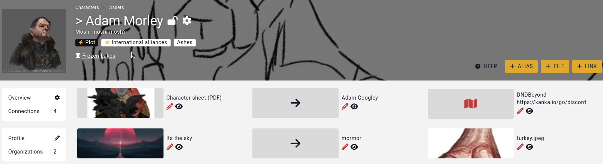
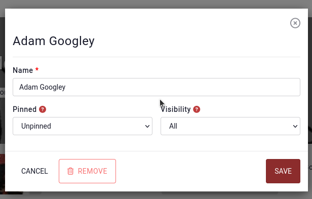
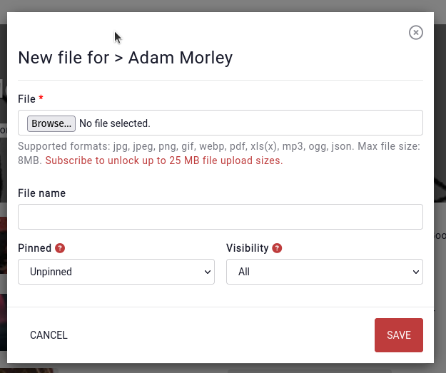

# Assets

Every entity has a subpage called "Assets" which contains miscellaneous content that is related to the entity.

The first asset type are [Aliases](/features/aliases), which can be used for search and mentions.

The second asset type are uploaded **files** to the entity. By default, an entity can have 3 files attached to it, generally an image, pdf, or image. [Premium](https://kanka.io/en-US/premium) campaign can have **10** files attached to each entity.

Lastly, the third asset type are **links**. For example, if a character has a character sheet in DndBeyond, or you wish to attribute the image used on the entity, adding a link to that resource outside of Kanka will add the link in the entity's [profile sidebar](/features/profile-sidebar).

