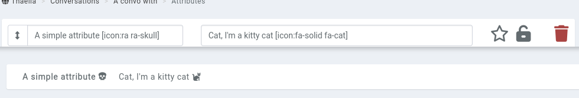

# Attributes

Attributes are little bits of information attached to an entity. The most obvious example is a [character's](/entities/characters) **HP**, or a [location's](/entities/locations) **population**.

## Attribute types

Attributes are split off into multiple types. The most basic one is simply a text block of up to 191 characters, containing (mostly) whatever you desire.

The types and their usage are as follow:

* **Attribute**: 191 character, anything goes attribute.
* **Checkbox**: A checkbox. If selected, appears as a _checkmark_ in the entity's attributes, and nothing when empty.
* **Multiline text**: For if you want to write about the entity's favourite recipe in attributes, you can.
* **Numbers**: Limit the content of the attribute to a numerical value.
* **Section**: After a while, an entity with lots of attributes can get visually messy. Use sections to split off attributes into their own "boxes".
* **Random**: Only available in [attribute template](/entities/attribute-templates).

## Syntax

You can reference entities in attributes using the advanced mention syntax `[entity:id]` or typing `@abc` in the attribute value field. You can also reference other attributes by using the `{Level}` syntax.

You can get creative with some [basic math](https://github.com/chriskonnertz/string-calc) options. For example, an attribute with the value of `{Level}*{Con}` will multiple the `Level` and `Con` attributes of this entity. If you want to round up or down, you can use `floor({Level}/3)` or `ceil(({Con}*{Level})/2)` as well.

Number attributes can be set up to only allow values between a range of numbers. For example, use `Level[range:1,10]` to limit the attribute between 1 and 10. The range values can also reference other attributes, for example with `HP[range:0,{MaxHP}]`. When saving an attribute, if the value is outside the range, it will automatically revert to the closest range value.

The same syntax can also be used in a standard attribute to create a dropdown of preset options when live-editing an attribute in a [character sheet](/marketplace/character-sheets) or in the entity’s Attributes page, for example with `[range:London,Berlin,Zürich]`. However, the full Attributes form will still show them as text fields and accept any value.

When creating or editing an [attribute template](/entities/attribute-templates), you can set random attributes. This can either be a random value between two numbers separated by `-`, or a random value from a list of values separated by `,`. The value for the attribute is determined when the template is applied to an entity, or when an entity is saved.

For example, if you want a number between 1 and 100, use `1-100`. If you want a value from a list of options, use `London, Berlin, Rome, Zürich`.

You can reference the entity's name in an attribute value with `{name}`. If an attribute exists with that name, the attribute will be used instead.

Icons from FontAwesome and RPGAwesome can be rendered for example with the `[icon:fa-solid fa-user]` or `[icon:ra ra-aura]` syntax, both in the attribute name and attribute values. Note that mentioning an attribute that contains an icon in its name doesn't always work and will randomly break. 

## Privacy

An attribute can be kept private from your players, for example the BBEG's weakness to fire, by clicking on the **lock** icon. When enabled, only members of the campaign's admin role will see the attribute.

## Pinned attributes

Attributes can also be pinned to the [entity's profile sidebar](/features/profile-sidebar) using the **star** icon.

## Attribute templates

When creating or editing an entity, the top of the **attributes** tab contains an option to select an [attribute template](/entities/attribute-templates). Doing so will add attributes from that template when the entity is being saved. If an attribute exists on the entity and the template, only the attribute from the entity is saved.

If you want to apply a template to multiple entities at a time, look at the [bulk options](/guides/bulk).
