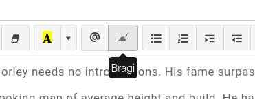

# Bragi

**Bragi** is Kanka's experimental AI-powered character backstory helper. Available for our Wyvern and Elemental [subscribers](https://kanka.io/en-US/pricing), Bragi is accessible in the text editor of [characters](/entities/characters) as a "hat" icon.

This opens up Bragi's interface, where, provided a short prompt between 10 and 150 characters, it will generate three paragraphs of backstory.

## Tokens

Subscribers with access to Bragi get a set number of tokens to use each month. Each generation uses one token, regardless of if the generated text is used or not.

Tokens refill monthly on the day of their subscription. Unused tokens are lost.

When you've exhausted your tokens, an alert will be displayed with the date at which your tokens refill.

### History

You can find a history of what Bragi generated in your current monthly cycle under [this address](https://kanka.io/en-US/settings/bragi).

## Under the hood

Bragi uses [OpenAI's GTP-3](https://beta.openai.com/docs/introduction) to generate a short backstory for a character.

## Limitations

We've built Bragi with the following limitations that we think you should be aware of.

### Language

Bragi currently only generates backstories in English, but accepts prompts in other languages.

### Bias

Backstories are currently set up with a fantasy bias, but we hope to allow more flexibility in the future.

### Repetition

As with all AIs, there is a certain repetition in the answers that can occur. As we gain more experience with these new technologies, we'll keep adding more variations to the backstories that Bragi can generate.