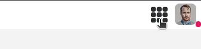
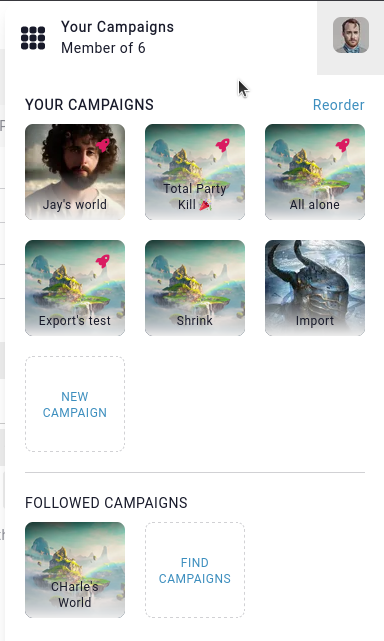

# Campaign Switcher

On most pages of Kanka, you can switch to another campaign by clicking on the "grid" icon on the top-right of the page.

This opens up the campaigns you are a part of, and the campaigns you follow. This is also the place to be able to create a new campaign.

## Background image

The image used to represent the campaign is the campaign's image, which can be changed by editing the campaign and filling out the **image** field.

## Premium icon

Premium campaigns (and legacy boosted and superboosted) are marked with a small rocket ship or diamond icon.

## Changing the order

By default, campaigns appear in the order of you joining/following them. This can be changed in your [appearance settings](https://app.kanka.io/settings/appearance). The option is usually called **Campaign switcher default order**.