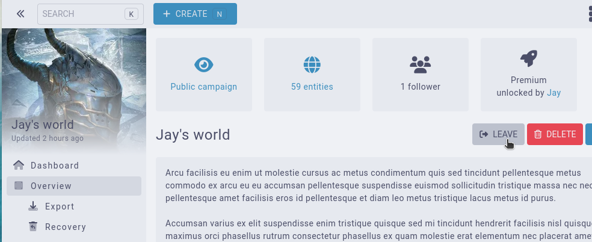

# Leaving a campaign

To be able to leave a campaign, there needs to be other members in it. You cannot leave a campaign if you are it's only admin, as this would leave the campaign widowed. 

If you meet these conditions, you can leave a campaign by clicking on `Settings` and on the `Leave campaign` button.

