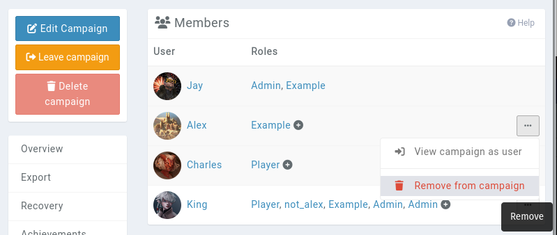

# Members

Inviting your friends and players to your campaign is a similar process to Discord. In the **World** and **Members** page, you can see the members of your campaign, and control their roles.

At the bottom of this page, you can create a new invite link for them to join the campaign.

## Removing members

You can remove non-admin members from your campaign in this same interface. Click on the **...** button to the right of their names and select **remove**.

Doing so will notify them in Kanka that they have been removed. None of the content they've created in the campaign is deleted.

## Related

[Testing permissions](guides/testing-permissions)