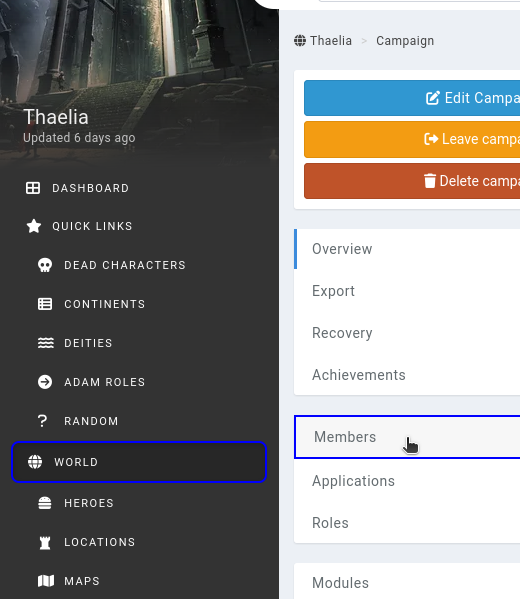
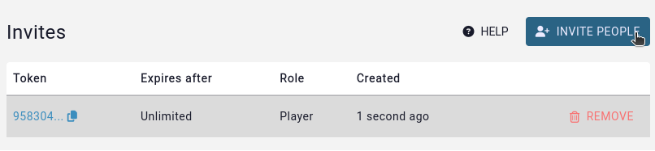
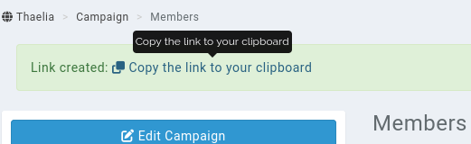
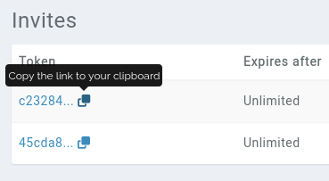

# Members

Inviting your friends and players to your campaign is a similar process to Discord. We've made it as easy as possible, which we detail how in this page.

## Inviting members

To invite members, you need an **invite link**. From the sidebar, click on **world** or **campaign** to access the campaign management pages, and then go to the **members** subpage.

This interface shows you your campaign members. Below the list of members you can find an **Invites** section. This is where you'll create invite links to send to your friends.

Click on the **Invite people** button

This opens up a request for some extra info.

### Invite link options

* **Expires after**: If you want the link to automatically delete itself after being used, you can select a value for this option.
* **Role**: This controls which role your friends will be joining the campaign with. For security purposes, it isn't possible to set this as the admin role.

After hitting **generate link**, you'll see a confirmation message at the top of the page, and a link to copy the invite link to your clipboard.

### Accessing the quick link

You can always re-copy the invite link to your clipboard by clicking on the "copy to clipboard" icon in the list of invite links.

## Removing members

You can remove non-admin members from your campaign in this same interface. Click on the **...** button to the right of their names and select **remove**.

Doing so will notify them in Kanka that they have been removed. None of the content they've created in the campaign is deleted.

## Related

[Testing permissions](/guides/testing-permissions)