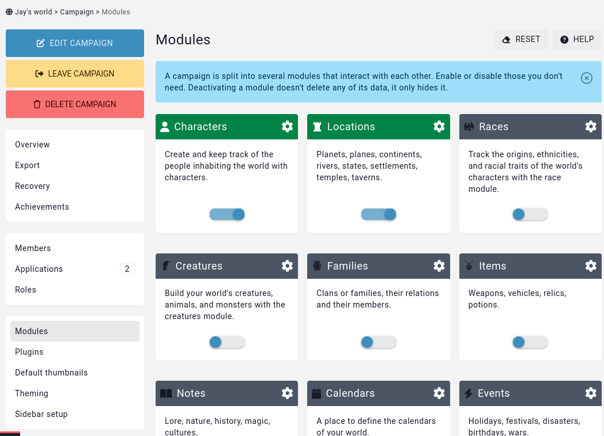

# Modules 

By default, a campaign has over fifteen types of entities enabled. If your world has no use of calendars or quests, these can be disabled.

From the campaign sidebar, click on **World**, and then go to the **Modules** subpage. This interface allows you to enable or disable types of entities that the campaign doesn't need.

```{admonition} Info
Disabling an entity type doesn't delete the related data from the campaign. Instead, it is simply **hidden**. Only members of the campaign's admin role can enable or disable modules.
```

## Modules enabled by default

Campaigns have automatically all modules enabled, except for the deprecated [conversations](/entities/conversations) and [dice rolls](/entities/dice-rolls) modules.

## Example

In the following example, all modules except for [characters](/entities/characters) and [locations](/entities/locations) have been disabled.

;