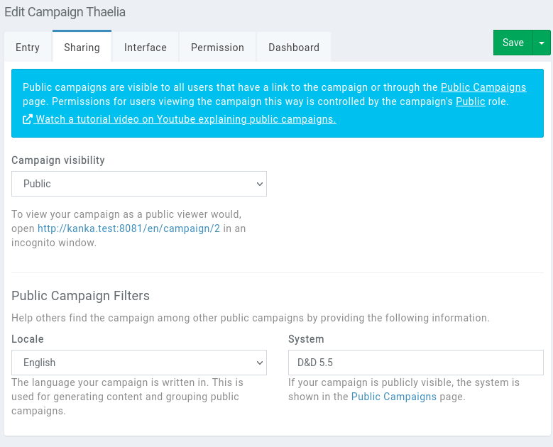
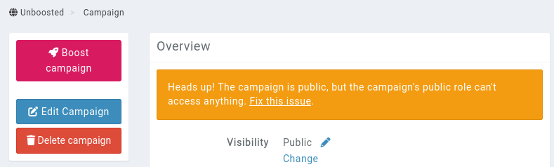

# Public campaigns

World builders and campaign managers might want their world to be freely visible from people who aren't in their campaign. This is achieved by browsing the [public campaigns](https://kanka.io/en-US/public-campaigns) page.

**Featured campaigns** are those selected by the Kanka team to showcase amazing worlds, as well as those who have won previous [worldbuilding prompts](https://kanka.io/en-US/community-events).


Below the featured campaigns are all public campaigns that have at least 5 entities visible to the public role. This condition is re-calculated every night at `01:00 UTC` for all public campaigns.

Campaigns can be filtered by **locale**, **system** (only the 20 most popular systems are shown here), by their **premium** status, and by their **[open]**(features/campaigns/applications) status. By default, campaigns are ordered by the number of entities visible to the **public** role, but this can be changed to the number of followers.


## Defining a campaign as public

While the following Youtube video is outdated in its interface, the concepts covered still hold true.

[](https://youtu.be/VpY_D2PAguM)

To make your campaign public, click on **World** in the campaign sidebar, and on **Edit campaign**. This will bring up the campaign's form. The **Sharing** tab has all the information related to public campaigns.



Set the **Campaign visibility** field to **public** and save the campaign.

The campaign is now public. Go to the dashboard, copy the URL, and open it in an incognito window. It should work! However, you'll quickly realise that it's empty. This is because while the campaign is public, the **public role** has no permissions set.

If you go back to your logged in browser window and click on **World** again, you should be greeted by a warning on the page.



Click on **Fix this issue** to go edit the campaign's public role's permissions. Here you can set the various blanket permissions you want to allow the public role to access on entity types. [Find out more about permissions here](/features/permissions).


```{admonition} Info
The **public role** only has read permissions, and is used by all users **not** part of the campaign.
```


Save the permissions changes, and refresh your incognito window. You should now see content. If it's not working, come get help on our [Discord server](https://kanka.io/go/discord).