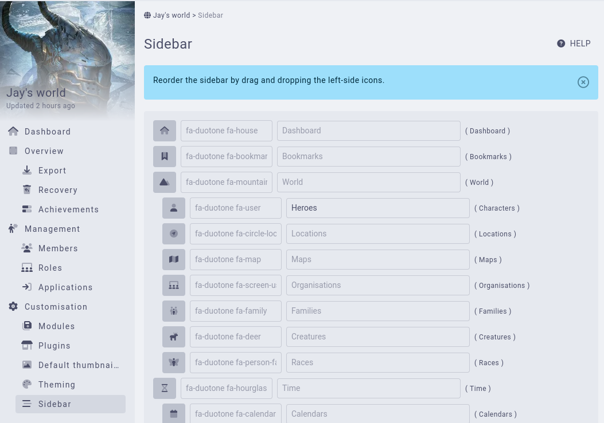
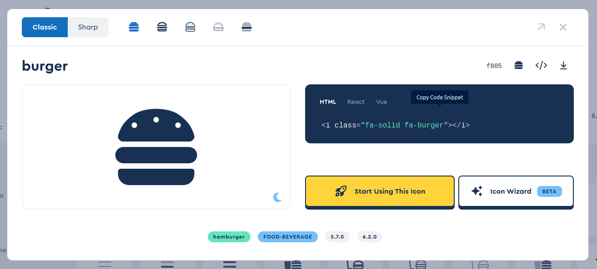
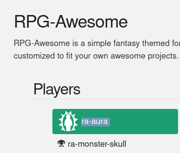
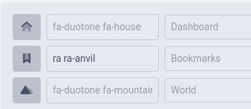

# Sidebar

[Premium campaigns](https://kanka.io/en-US/premium) can customise their sidebars. To do so, go to **World** and **Sidebar setup**.

In this interface, you can reorder elements of the sidebar, change their icons, as well as their labels. These change effect all users of the campaign and in all languages. The custom names aren't reflected in the rest of the application. Meaning renaming **characters** to **heroes** will only change the sidebar.

When reordering elements of the sidebar, you cannot for example put Quick Links inside another element. You can however make Conversations as the first element of the sidebar, if you so wish.

## What fonts are available?

You can use any of [FontAwesome's](https://fontawesome.com/search) or [RPGAwesome's](https://nagoshiashumari.github.io/Rpg-Awesome/) fonts.

### Using FontAwesome

To use a FontAwesome icon, click on the desired icon and click on the HTML **Copy code snippet**. This copies the icon to your browser.

Next, paste the value in the campaign sidebar **icon** field. The HTML will automatically be transformed to a format supported by Kanka.

### Using RPGAwesome

To use an RPGAwesome icon, copy the desired icon's "name" and paste it in the **icon** field. You'll also need to append **ra** (with a space in front) to make it work.

For example, if you want to use **ra-anvil**, write **ra ra-anvil** in the icon field.

