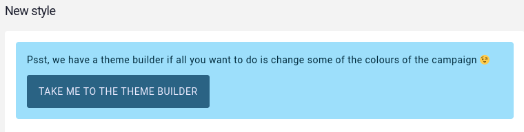
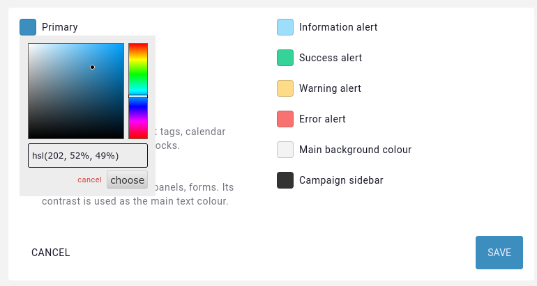
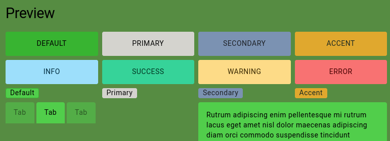

# Theme Builder

You don't need to be a CSS wizard to customise the style of your campaign. If you don't find themes that fit the look you're going for in the [marketplace](https://marketplace.kanka.io), head over to your campaign theming to get access to the theme builder.

## Accessing the theme builder

To access the theme builder, from the campaign sidebar, click on **World** and then on **Theming**. From the [campaign theming](/features/campaigns/theming) interface, create a **New style**. If the theme builder hasn't been used yet in the campaign, a link to it will be displayed above the style form.



## Using the theme builder

Once in the theme builder, a few clickable buttons are visible. Clicking them brings up a colour picker to set the colour for that "section". Kanka's styling is separated into separate sections explained a bit later, but we first recommend playing around with colours and see what happens.



## Live preview

Whenever a colour is picked, a preview of various elements of Kanka's interface automatically updates lower in the page, so you aren't left guessing.



## Saving and editing

Saving the theme builder's colours will add a new style to the campaign. Editing the theme can be done by editing the style in the [campaign theming](/features/campaigns/theming) interface, which will bring up the theme builder.

As with other styles, it can be disabled or deleted. If the theme is deleted, the button to the theme builder will appear again when creating a new style.

## Deep dive

Kanka's CSS and theme builder is inspired by [DaisyUI](https://daisyui.com/), which is where Kanka gets the variable name and split from.

If you wish to fully customise the campaign theme manually, you can define the following variables in a campaign style.

```css
:root {
    // The main content background colour
    --content-wrapper-background: #f3f3f3;
    
    // Primary colour, used for buttons and links
    --p: 202 52% 49%;
    // Primary colour when focused
    --pf: 202 52% 34%;
    // Foreground content colour to use on primary colour
    --pc: 243 100% 96%;

    // Secondary colour, currently unused
    --s: 215 26% 59%;
    // Secondary colour when focused
    --sf: 215 26% 52%;
    // Foreground content colour to use on secondary colour
    --sc: 216 13% 13%;

    // Accent colour, used for some important buttons like "new post"
    --a: 41 74% 53%;
    // Accent colour when focused
    --af: 41 74% 46%;
    // Text colour for accent
    --ac: 151 21% 13%;

    // Neutral colour, for example for the page's background, code and pre elements, tooltip borders
    --n: 233 27% 13%;
    // Neutral colour when focused
    --nf: 233 27% 6%;
    // Text colour for elements with the neutral colour background
    --nc: 210 38% 95%;

    // Base background colours, used for boxes, panels, modals
    --b1: 0 0% 100%;
    --b2: 0 0% 93%;
    --b3: 0 0% 86%;
    // Text colour for elements on a base background
    --bc: 233 27% 13%;

    // Info messages background and foreground
    --in: 198 93% 80%;
    --inc: 198 100% 12%;

    // Warning messages
    --wa: 43 96% 76%;
    --wac: 43 100% 11%;

    // Error messages
    --er: 0 91% 71%;
    --erc: 0 100% 14%;

    // Success messages
    --su: 158 64% 52%;
    --suc: 158 100% 10%;

    // Sidebar
    --si: 0 0% 20%;
    --sic: 0 0% 90%;

    // Border radius for buttons
    --rounded-btn: .25rem;
    // Border radius for badges (tags)
    --rounded-badge: .25rem;
    // Animation durection when a button is focused
    --animation-btn: 0;
    // Scale effect on buttons when focused
    --btn-focus-scale: 1;

    // Button border width
    --border-btn: 1px;
    // Button text transform
    --btn-text-case: uppercase;

    // Border radius for tabs
    --tab-radius: .25rem;

    // Border thickness for tabs
    --tab-border: 0px;
}
```

All colours except for the background colour are defined in the human friendly HSL format. In case HEX colours are more familiar to you, you can use a tool such as [W3C Color Converter](https://www.w3schools.com/colors/colors_converter.asp) and convert to HSL. Note that the HSL values in Kanka need to be just the values, no `hsl(` and no commas.