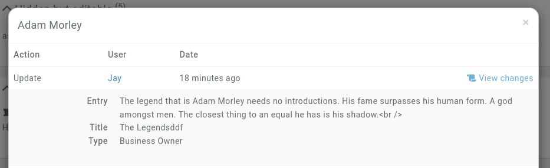

# History

Whenever an entity is created, modified, deleted or [restored](/features/campaigns/recovery), a log is saved with that information for 90 days.

## Entity history

An entity's history can be view directly on it. When on the overview page of an entity, scroll down and click on the **View entity log** link.


This brings up a summary of changes recently done to the entity.


### Full save logs

[Premium campaigns](https://kanka.io/premium) get access to the full changes made to an entity in this interface. When saving an entity, the previous values are saved in the log, and is available for 30 days.

Clicking on the **View changes** link reveals the previous values.



```{admonition} Warning
Note that the campaign **already needs to be **premium** when making changes for the old values to be saved. Unlocking premium features on a campaign after an entity was changed won't give you access to the old values.
```

#### Limitations

These logs don't track changes to sub-elements of an entity, for example attributes, posts, reminders, etc. Only changes on values directly related to the entity are logged.

## Unified interface

Admins of a superpremium campaign get access to a **History** page, accessible towards the end of the sidebar. This displays the changes done on the whole campaign, with filters available for specific members or specific actions.

The full entity changes are available on the **Changes** button.


## Notifications

Currently, there is no way for Kanka to notify campaign members when changes are done to entities.