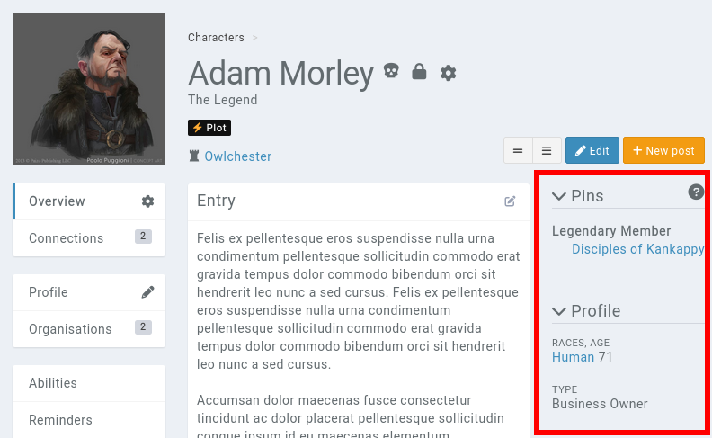

# Profile Sidebar

Throughout these docs and in Kanka, you'll see a mention of an entity's **profile sidebar**. When viewing an entity's **overview** page, this is the right section of the page, marked in the image below.



## Pins

The first section contains **pinned** elements. These can be [attributes](/features/attributes), [relations](/features/relations), of the entity's attached files.

Characters and organisations also display pinned organisation members in this section.

By default, the section is always visible to a campaign's admin, even when empty. The section is hidden to non-admins when there is nothing to display.

```{toctree}
---
maxdepth: 1
---
profile-sidebar/pinning
```

## Profile

The profile section is filled out by various fields from the entity, including a character's [age](/advanced/age).

## Links

If the entity's assets include links, they are displayed in this section.
