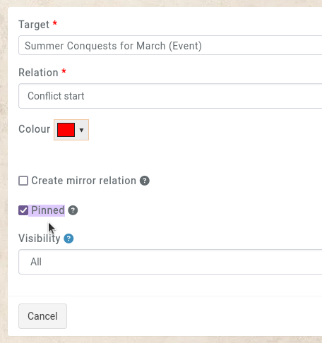
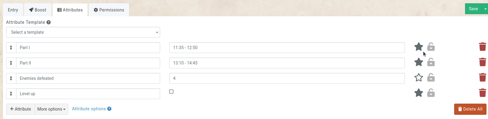
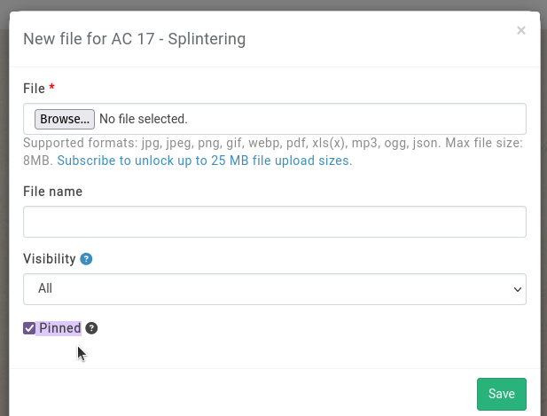
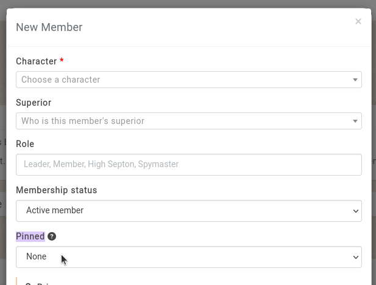

# Pinning

Pinning elements to the sidebar is configured when creating or editing elements that can be pinned.

## Pinning Relations

When creating or editing a relation, the `pinned` option can be activated.

## Pinning Attributes

When editing all of the attributes of an entity (either in the entity's `attributes` tab or from the `manage` button in the `attributes subpage`), clicking on the `star` icon on the right will pin the attribute.

## Pinning Files

When creating or editing a file (under the entity's `assets` subpage), the `pinned` option can be activated.

## Pinning organisation members

When creating or editing a member of an organisation, the option to pin that member is available. The options include pinning the membership on the character, the organisation, or both.

