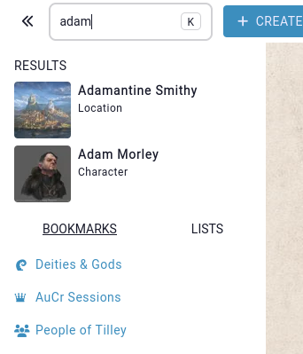
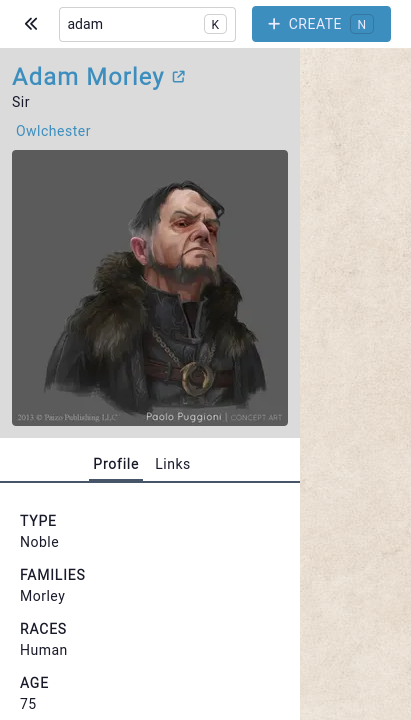

# Search

The search field at the top of every page (accessible by clicking `Ctrl+K`) will allow you to search for entities in the campaign based on their names.

Clicking on an entity's image will go to the entity. Clicking on its name opens up a "quick preview" interface.

## Related

[Full-text search](/advanced/fulltext-search)
[Filtering the search](/advanced/filteres)
