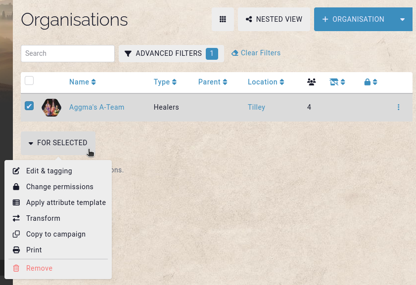

# Bulk

**Bulking** in the context of Kanka isn't related to getting big and muscular, but has the same effect on your worldbuilding. Bulking is the concept of applying something to multiple entities at a same time.

When viewing a list of entities, for example the campaign's events, a checkbox is visible to the left of each row. Selecting one activates the **bulk** menu at the bottom of the list.

## Editing & tagging

The first option is to edit the properties of multiple entities at a time. Say you want to apply a tag to multiple entities, change their type, change their location, etc.

## Change permissions

This option allows you to remove, replace, or add [permissions](features/permissions) to multiple entities at a time. Useful when you finally decided to invite your players to the campaign, but realise they can now read all the terrible plot-hooks you've prepared.

## Apply attribute template

Apply an [attribute template](entities/attribute-templates) to multiple entities at a time.

## Transform

Just finished creating 20 events and only now realise they are supposed to be items? This option will save your life, and sanity.

## Copy to campaign

You've done all the hard work once. Why do it again? Copy multiple entities from one campaign into another. Great for when your party ultimately gets TPK'd and you want to start fresh, but reuse elements from the old campaign.

## Print

Going hiking with your players and want to play at night at a camp fire with no internet? Quickly print the relevant entities for your session. Don't forget your dice!

## Remove

My favourite option. You've created this great story with a whole kingdom of humans, dwarves, hobbits and elves. You're rightfully proud of your work, well done champ! However, during session 1, your players killed the prince, eat all the king's food, and drew multiple phallus on the castle walls before setting it on fire. Such a shame, you had high hopes for this group. _Sigh_. Oh well, let's delete all of their characters from the campaign in a single swoop. No hard feelings, really. They had it coming. Don't forget to [kick them out of the campaign](features/campaigns/members) while you're at it. Purge the filth from these fertile lands.