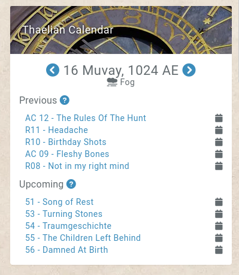
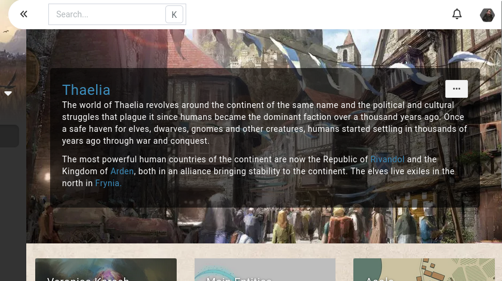
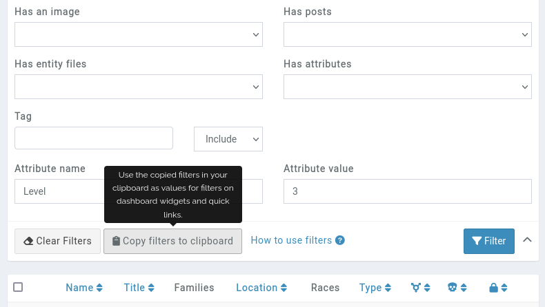

# Customising a dashboard

A campaign's dashboard is the default page members of a campaign see. When a campaign is nearly created, it's fairly empty. To start adding **widgets** to the dashboard, scroll down and click on the **dashboard setup** button.

## Dashboard setup

This page allows you to add more widgets to a dashboard by scrolling to the bottom of the page and clicking on the **add new widget** block. Existing widgets can be moved around by drag-and-drop (this doesn't work on mobile devices).

There is no limit for the number of widgets on a dashboard, but the more info, the longer the page load, the less clarity the dashboard has, and the worse the experience for you and other users due.

## Types of widgets

There are several type of widgets that can be added.

### Entity List

This shows a list of entities on the dashboard. This can be set up to show only entities of a specific type, and in which order they are displayed. Filters allow more control on exactly what is shown.

### Entity Preview

This *pins* an entity to the dashboard, showing its image and a preview of the entity's entry.

### Calendar

This widget displays one of your campaign's calendar on the dashboard, including 5 previous and upcoming events.

#### Known Limitations

The more reoccurring reminders in a calendar, the less the previous/next list is accurate, by virtue of the code not being able to process thousands of reminders on each page load, each with custom reoccurring values and varying permissions.

Reminders reoccurring on moon phases are also completely ignored from the calendar widget, as those are impossible to calculate without regenerating the whole calendar.

### Text Header

This add a full row of just text on the dashboard, useful for splitting sections up. For example having a "The heroes" text above 4 entity previews of the campaign's players.

### Random Entity

Similar to the entity preview, this however selects a random entity from the campaign to display on the dashboard.

### Campaign Header

Always visible on the default dashboard of a campaign, this widget can be added to other dashboards and shows the campaign's name, short description, and dashboard image as a background.

### Widget Filters

You can filter entities displayed on the recently modified and random widget by providing a list of fields of the entity and values. For example, you can use `is_dead=1&type=NPC` to filter on dead characters of the NPC type.

To make your life easier, when viewing a filtered list of entities, the filters will have a **copy to clipboard** button. For example, when viewing the characters of the campaign, filter on the kind of characters you want to display, click the button, and past the result in the widget's **filter** field.

## Custom Dashboards

[Premium campaigns](https://kanka.io/premium) can have more than a single dashboard.

Non-default dashboards have their own simple permission engine linked to the campaign's roles. For example, a dashboard can be the default one for your players, with a focus on their current quest progress.