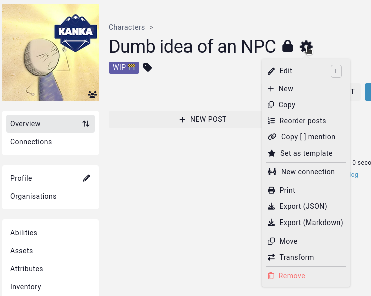

# Deleting entities

There are several ways to delete entities from your world, for when your players (or if we're being honest here, it was probably you) created a or multiple duplicates of an NPC or location.

## Deleting a single entity

To delete a single entity, go to that entity, click on the cog wheel next to their name to open up the **action menu**. The last option will always be to delete the entity (if you have the right [permissions](/guides/testing-permissions)).

## Deleting multiple entities

To delete multiple entities at a time, use the [bulk](/guides/bulk#remove) option.

## Recovering deleted entities

Accidently deleted something you shouldn't have? Learn about [recovering deleted entities](/features/campaigns/recovery).

