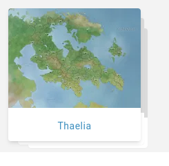

# Entity Lists

When looking at all the characters, locations, or other module of the campaign, we call this an "entity list". For example, a "character list".

## List modes
By default, entities are shown in a **grid** view with a focus on visuals.

This is in contrast with the **table** view, which isn't visually pleasing but has more information and enables [bulk actions](/guides/bulk).

### Switching modes

When viewing a list, of a different view mode is possible, a button will appear on the top right.

###  How to set the default

When switching from one mode to another, Kanka will automatically remember the last mode you selected [per module](/features/campaigns/modules), so you can keep your characters in grid view, but have your quests in table view. This feature only works if you are logged in to your Kanka account.

## Stacking

When in **grid** view, by default, entities with children will have a "stack" below them. Clicking on the image will display the children of the entity, whilc clicking on its name will go to that entity.

### Disabling stacking

To disable stacking and have all entities of the current module displayed in the grid, click on the **flatten** button at the top right.

## Filters

Filters (accessed by clicking the **advanced filters** button) are remembered by module, but not by view mode. So if you filter on all dead characters, switching between grid and table view will not reset the filter. Filters are also remembered by account, module, and world.
