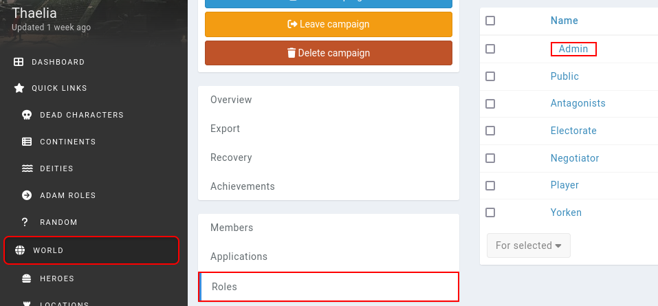
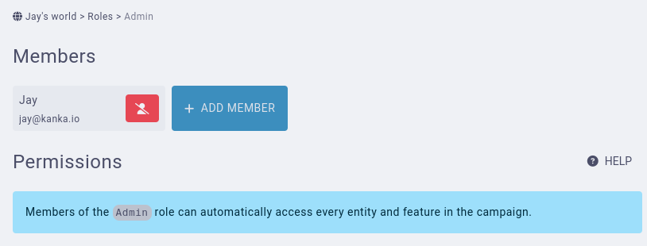

# Removing Admins

There are several situations where you might want to remove an admin from the campaign. Maybe a friend was helping set up the world as an admin and now needs to be a player, or you yourself prepared a campaign for your DM and want to hand over the reigns. Let's look at how to handle these scenarios.


```{admonition} Core protection
To avoid abuse, admins cannot remove other members from the admin role. Members have to remove themselves from the campaign's admin role.
``` 

## Removing yourself

Log in to your account, and from the campaign, click on **world** or **campaign** in the sidebar to go to the campaign management interface. From there, go to the **Roles** subpage, and click on the admin role's name. The admin role is always at the top of the list.



In this new interace, click the **remove user from role** icon next to your name. A confirmation will ask you if you are sure. Confirming will remove you from the admin role.



## Removing someone else

As explained above, to avoid abuse, an admin cannot remove another member from the campaign's admin role. An exception to this rule is if the member was added in the **last 15 minutes**, to avoid complications in case of a mis-click.

## Human support

If an admin account was hacked and the campaign needs to be transferred manually to someone else, you can contact us by email, and we will look at what can be done. To avoid this happening, we recommend enabling [two factor authentication](/account/security/two-factor-authentication) on your account.


