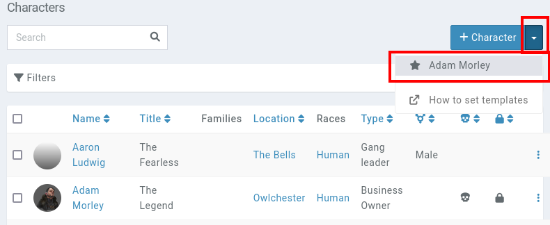
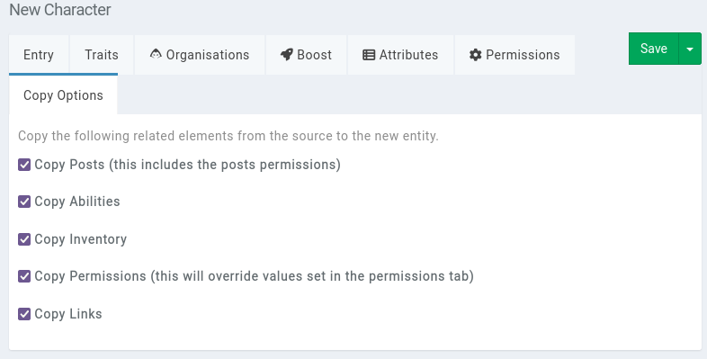

# Templates

If you find yourself copy-pasting boilerplate content from existing entities to your new entities, you will be better off setting one or multiple **entity templates**.

## Example

For example, we are going to create a character template for all of our NPCs.

First off, create the [new character](/entities/characters) and fill out the fields you want it to have. This new character might have some default tags like a To-Do tag, some text in the entry, some default traits you want to remember to fill out, or some attributes that are important for your game. You can also give it some default attributes, a "plot" [post](/features/posts), abilities and more.

Once your character is created, view it and click on the `...` button to the right. This opens the character's **action menu**. From there, you should see the option labelled **set as template**.

This sets the new character as a template.

### Creating a character based on the template

To create a new character based on the template, navigate to the characters page of your campaign. In the top right, next to the new character button, you'll now see an option with the template's name.

This brings up the new character page, with fields filled out from the template. The name is always empty, to help avoid having multiple entities with the same name.

In the form's copy options tab, you can control which related elements are to be copied over. All of these options are enabled by default.

### Removing a template

To remove an entity as being a template, click again on the entity's **action menu** cog icon and select the option **Remove as template**.

## Miscellaneous details

Templates are bound to an entity type. Meaning that a character set as a template can only be used to create a new character.

If members of your campaign can create a character and have access to the template (meaning they can view it), they also get the option to create a new character based on the template. The same applies for other entity types of your campaign.
