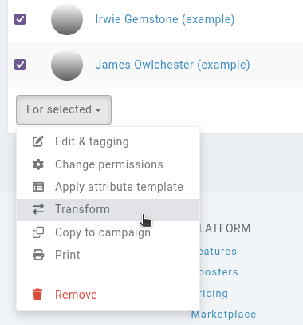

## Transforming an entity's type

Since entities all share a similar base, this means you can change an entity's type after you've created it. Say you create an [event](/entities/events), fill it out, and later realise you want an [item](/entities/items) instead. No worries, you can change the entity's type in its **actions**, accessed by clicking on the "cog" next to the entity's name.

## Data gained, data lost

This transform will keep all the shared data the two entity types. For example, if you transform an event to an item, the item has no _date_ field, so that is lost. Transforming the item back to an event will not recover the _date_ value.

However, the name, type, entry, tags, permissions, attributes, posts, reminders, relations etc are all kept. You also don't need to update any **mentions** targeting the original event, Kanka automatically keeps track and updates all of them!

## Transforming multiple entities

It is possible to transform multiple entities at a time, rather than transforming each one individually. To do so, simply go to a list of entities of the campaign, for example the campaign's [characters](/entities/characters).

On the left of every character name is a checkbox. Click on the checkboxes of entities that need transforming, and select the `Transform` option from the dropdown menu.

