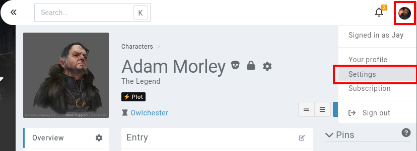

# Appearance settings

Your profile settings can impact the visuals and workflows of your Kanka experience. You can change these [here](https://kanka.io/en-US/settings/appearance), or when in Kanka, by clicking on your profile picture and on **settings**, then going to **appearance** in the sidebar.

## Theme

Changing your theme impacts how campaigns render in Kanka. Note that any campaign can override your settings.

## Pagination

If you want more than 15 characters shown in the characters list, you can change this value here. [Subscribers](https://kanka.io/en-US/pricing) get access to **100** entities per page.

## New entity workflow

When creating a new entity, Kanka redirects you to the list of entities of that type. You can change this to show the newly created entity instead.

## Text editor

Kanka has two text editors, but we highly discourage using the legacy one. Some features like advanced mentions and the [campaign gallery](campaigns/gallery) don't work in it. Its only advantage is that it has a more powerful table editor.

## Advanced mentions

If you wish to always use `[entity:123]` mentions, even when using `@`, activate this option. [More info here](/features/mentions).